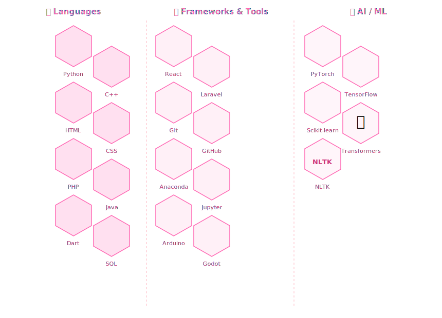

    

<samp>
「 AI Engineering Student passionate about Machine Learning, NLP, RAG Systems, and Intelligent Applications. 」  
</samp>

 

    
     
     

---

# 🛠 Technologies
<!-- 

  

 -->

  

---

### 📊 Vital Statistics

  

  

  
  &nbsp;
  

  

  

---<table width="100%">
<tr>

<!-- LEFT -->
<td width="50%" valign="top">

## 🤝 Collaboration

I'm open to collaborating on:

- 🧠 Machine Learning Projects
- 📚 NLP & RAG Applications
- 🤖 Robotics & Autonomous Systems
- 💻 Open Source AI Projects
- 🚀 Innovative AI Solutions

</td>

<!-- RIGHT -->
<td width="50%" valign="top" align="center">

## 📫 Contact Me

 

  

  

</td>

</tr>
</table>

⚡ Building scalable AI systems and machine learning infrastructure

Star ⭐ the repos if they helped you!

  <a href="./CODE_OF_CONDUCT.md">Code of Conduct</a> ·
  <a href="./CONTRIBUTING.md">Collaboration</a> ·
  <a href="./SECURITY.md">Security</a>

